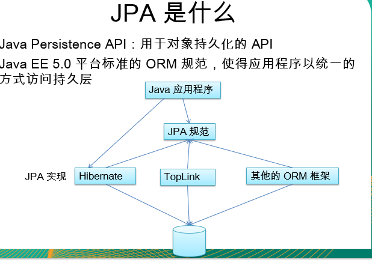
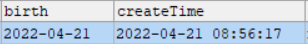
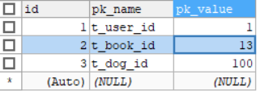
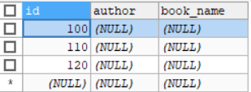
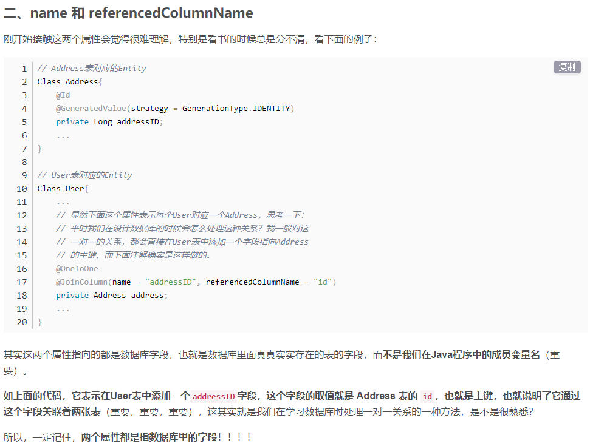
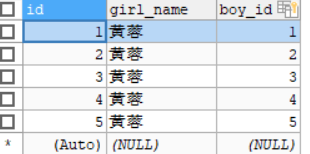
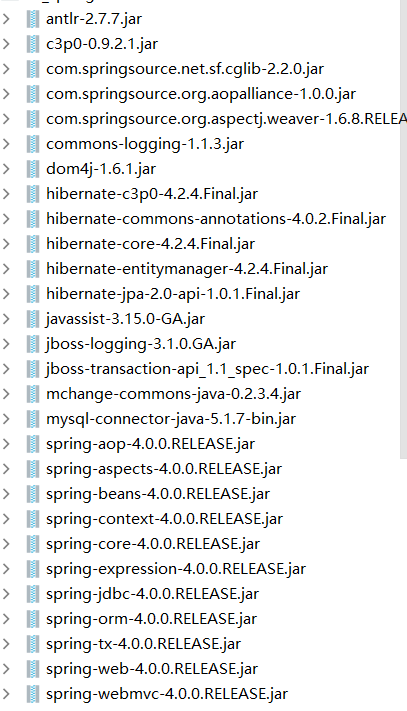
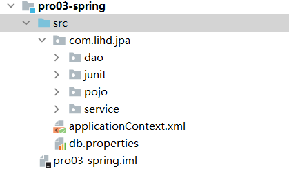
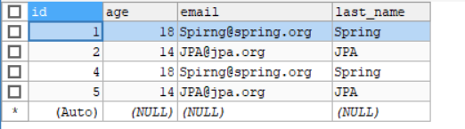

## JPA HELLO WORLD

#### 1 认识jpa



#### 2 jpa HelloWorld
1 idea新建java项目
2 导入java包 add as lib
3 此时会提醒你导入jpa 工件
4 在src下新建 META-INF/persistence.xml文件名和路径都是固定的
5 开始愉快的编程

核心代码 
```java
@Test
public void test01 (){
        //1 创建EntityManagerFactory
        String persistenceUnitName = "jpa-pro01";
        EntityManagerFactory entityManagerFactory = Persistence.createEntityManagerFactory(persistenceUnitName);

        //2 创建EntityManager
        EntityManager entityManager = entityManagerFactory.createEntityManager();
        //3 开启事务
        EntityTransaction transaction = entityManager.getTransaction();
        transaction.begin();
        //4 进行持久化操作
        User user = new User();
        user.setUsername("hello jpa");
        user.setPassword("persist");
        user.setEmail("notnull@notnull.org");
        user.setCreateTime(new Date());
        user.setBirth(new Date());

        entityManager.persist(user);

        //5 提交事务
        transaction.commit();

        //6 关闭EntityManager
        entityManager.close();

        //7 关闭EntityManagerFactory
        entityManagerFactory.close();
        }
```

## JPA的基本注解

#### 3 6个基本注解
注意看 注释
```java
package com.lihd.jpa.pojo;
import javax.persistence.*;
/**
 * 六个基本注解
 * 1 Entity 指出该表是一个实体 ， 将类映射到表
 * 2 table 去映射表的表名 使用name属性 不写的话表名就是类名
 * 3 Id 将一个属性映射到 主键 ， 建议放到get方法上 似乎可以放到任意位置
 * 4 GeneratedValue 生成主键的策略 默认的值是AUTO如果是AUTO可以不写默认值
 * 5 Basic 将一个简单属性映射到数据表中 ，不写默认就是@Basic
 * 6 Column 实体属性和表的字段名字不同时使用，可以设置其他约束
 *
 * 注意 ： 对于基本属性的方法 必须有get和set方法 否则报错
 * 其他注解
 * transient 说明这个属性不需要映射到数据库
 *
 *
 * @author ：葬花吟留别1851053336@qq.com
 * @description：TODO
 * @date ：2022/4/20 15:46
 */
@Entity
@Table(name = "t_user")
public class User {
    private Integer id;
    private String username;
    private String password;
    private Integer age;
    private String email;

    @Id
    @GeneratedValue(strategy = GenerationType.AUTO)
    public Integer getId() {
        return id;
    }

    public void setId(Integer id) {
        this.id = id;
    }

    @Column(name = "user_name")
    public String getUsername() {
        return username;
    }

    public void setUsername(String username) {
        this.username = username;
    }

    @Column(name = "pass_word")
    public String getPassword() {
        return password;
    }

    public void setPassword(String password) {
        this.password = password;
    }

    @Basic
    public Integer getAge() {
        return age;
    }

    public void setAge(Integer age) {
        this.age = age;
    }
    @Column(name = "t_email",length = 50,unique = true,nullable = false)
    public String getEmail() {
        return email;
    }

    public void setEmail(String email) {
        this.email = email;
    }


    @Transient
    public String getInfo(){
        //如果没有set  Could not find a setter for property info in class com.lihd.jpa.pojo.User
        return "username : " + username;
    }
}
```
#### 4 transient注解
注意 ： 对于基本属性的方法 
必须有get和set方法 否则报错
比如只有get方法的情况下 
Could not find a setter for property info in class com.lihd.jpa.pojo.User

transient 说明这个属性不需要映射到数据库 ，这样就不会出现上面的情况 

#### 5 @Temporal 指定时间的精度
@Temporal(TemporalType.XXX) 
1 DATE 只有日期
2 TIME 只有时间
3 TIMESTAMP 日期和时间 
这里需要注意 ：导入java.util.Date 而不是sql下的Date

```java
public class User {
    private Date birth;
    private Date createTime;

    @Temporal(TemporalType.DATE)
    public Date getBirth() {
        return birth;
    }

    public void setBirth(Date birth) {
        this.birth = birth;
    }

    @Temporal(TemporalType.TIMESTAMP)
    public Date getCreateTime() {
        return createTime;
    }

    public void setCreateTime(Date createTime) {
        this.createTime = createTime;
    }
}
```
生成格式  


#### 6 table主键生成策略
1 这种方式不常用 
2 这用方式比较通用 使用于任何数据库 

第一步 创建表 并且插入数据
```sql
CREATE TABLE t_id_generator(
id INT PRIMARY KEY AUTO_INCREMENT,
pk_name VARCHAR(50) NOT NULL,
pk_value INT NOT NULL
)

INSERT INTO t_id_generator VALUES
(0,'t_user_id',1),
(0,'t_book_id',10),
(0,'t_dog_id',100)
```

第二步创建java类
```java
public class Book {
    private Integer id;
    private String bookName;
    private String author;

    @Id
    @GeneratedValue(strategy = GenerationType.TABLE, generator = "ID_generator")
    @TableGenerator(name = "ID_generator",//和上面的generator值对应
            table = "t_id_generator",//找到生成主键的表
            pkColumnName = "pk_name",//找到生成主键表的生成字段的列
            pkColumnValue = "t_book_id",//找到该字段对应的值 从而确定某一行
            valueColumnName = "pk_value",//找到这一行 对应的值
            allocationSize = 10//每次增加的大小默认是50
    )
    public Integer getId() {

        return id;
    }
}
```
插入三条数据后 两个表的数据情况
  
  
## JPA的API

#### 7 Persistence EntityManagerFactory
主要看注释 
```java 
public class APITest {
    /**
     * Test01 : Persistence
     * 主要来用来获取 EntityManagerFactory
     * 两个方法(重载)
     * createEntityManagerFactory()
     *
     * 其实和spring整合之后 甚至不需要 使用这个方法 第二个重载方法了解即可
     *
     */
    @Test
    public void test01 (){
        //这里主要了解 第二个方法即可 可以实现对之前参数的覆盖
        EntityManagerFactory factory = Persistence.createEntityManagerFactory("jpa-pro01");
        HashMap<String, Object> map = new HashMap<>();
        map.put("hibernate.show_sql",false);
        EntityManagerFactory factory1 = Persistence.createEntityManagerFactory("jpa-pro01", map);

    }
    
    /**
     * Test02 : EntityManagerFactory
     * createEntityManager()：用于创建实体管理器对象实例。
     * createEntityManager(Map map)：用于创建实体管理器对象实例的重载方法，Map 参数用于提供 EntityManager 的属性。
     * isOpen()：检查 EntityManagerFactory 是否处于打开状态。实体管理器工厂创建后一直处于打开状态，除非调用close()方法将其关闭。
     * close()：关闭 EntityManagerFactory 。 EntityManagerFactory 关闭后将释放所有资源，isOpen()方法测试将返回 false，其它方法将不能调用，否则将导致IllegalStateException异常。
     *
     * 最主要的方法还是 create 和 close();
     */
    @Test
    public void test02 (){
        EntityManagerFactory factory = Persistence.createEntityManagerFactory("jpa-pro01");
        EntityManager entityManager = factory.createEntityManager();
        factory.close();
    }
}
```
#### 8 四个常用方法
```java
public class APITest2 {

    private EntityManagerFactory factory;
    private EntityManager entityManager;
    private EntityTransaction transaction;

    @Before
    public void init(){
        factory = Persistence.createEntityManagerFactory("jpa-pro01");
        entityManager = factory.createEntityManager();
        transaction = entityManager.getTransaction();
        transaction.begin();
    }

    @After
    public void destroy(){
        transaction.commit();
        entityManager.close();
        factory.close();
    }

    /*
    只能移除持久化对象 不能移除游离对象
     */
    @Test
    public void testRemove(){
        //移除游离对象报错
//        User user = new User();
//        user.setId(2);
//
//        entityManager.remove(user);

        //可以移除持久化对象
        User user = entityManager.find(User.class, 2);
        entityManager.remove(user);
    }

    /*
    使对象由临时状态变为持久化状态
    如果对象设置了id并且id存在 则会报异常
     */
    @Test
    public void testPersistence(){
        User user = new User();
        user.setUsername("hello");
        user.setPassword("111");
        user.setEmail("hello1@123.com");
        user.setBirth(new Date());
        user.setCreateTime(new Date());
        user.setAge(18);

        // user.setId(1); id存在会报错

        entityManager.persist(user);
        //此时id就会有值
        System.out.println(user.getId());
    }


    /*
    类似乎懒加载
    什么时候用到什么时候调用SQL
    entityManager关闭的情况下 可能会出现懒加载异常
     */
    @Test
    public void testGetReference(){
        User user = entityManager.getReference(User.class, 1);
        System.out.println(user.getClass().getName());
        System.out.println("----------------");
        // entityManager.close(); 会有异常
        System.out.println(user);
    }

    /*
    直接加载并且执行
     */
    @Test
    public void testFind(){
        User user = entityManager.find(User.class, 1);
        System.out.println("----------------");
        System.out.println(user);
    }

}

```

#### 9 merge
```java
  public class APITest2 {


    /*
    如果传入的是一个游离对象 （对象有oid） 满足
    1 在entityManager缓存中有对象
    jpa会把游离对象的属性值赋值到查询到的EntityManager缓存对象中
    EntityManager缓存的对象执行update

    其中有一个复制操作
    并不是对应了两个游离对象id相同（关联了两个对象id相同） 这样在jpa和hibernate都会报错
     */
    @Test
    public void testMerge4(){
        User user = new User("DD","DD",1);
        user.setId(6);
        User user1 = entityManager.find(User.class, 6);

        User merge = entityManager.merge(user);

        //user : 100
        //merge : 6
        System.out.println("user : " + user.getId());//null
        System.out.println("merge : " + merge.getId());//有值
        System.out.println(user1.getId());

    }

    /*
    如果传入的是一个游离对象 （对象有oid） 满足
    1 在entityManager缓存中没有该对象
    2 在数据库中有对应的记录
    jpa对查询对应的记录 然后返回该记录对应的对象 然后会把游离对象的属性赋值到查询到的对象中
    然后对查询的对象进行update操作
    因此结果会有一条select 一条update
    设置断点可以看到 set方法被调用了两次
     */
    @Test
    public void testMerge3(){
        User user = new User("CC","CC",1);
        user.setId(6);

        User merge = entityManager.merge(user);

        System.out.println(user == merge);

    }

    /*
    如果传入的是一个游离对象 （对象有oid） 满足
    1 在entityManager缓存中没有该对象
    2 在数据库中也没有对应的记录
    jpa会创建一个新的对象 把当前游离对象的属性赋值到新创建的对象中
    对新对象进行持久化insert操作

     */
    @Test
    public void testMerge2(){
        User user = new User("BB","BB",1);
        user.setId(100);

        User merge = entityManager.merge(user);

        //user : 100
        //merge : 6
        System.out.println("user : " + user.getId());//null
        System.out.println("merge : " + merge.getId());//有值

    }

    
    
    /* 
    如果传入的是一个临时对象user
    先创建一个新对象merge(复制操作) 对新对象进行 持久化操作
    因此user没有id而 merge 有id

     */
    @Test
    public void testMerge1(){
        User user = new User("AA","AA",1);

        User merge = entityManager.merge(user);

        System.out.println("user:" + user.getId());//null
        System.out.println("merge:" + merge.getId());//有值

    }


}
```


#### 10 flush refresh
```java
/*


    refresh会调用select 语句
    作用 保证数据库中的对象 和refresh的对象值保持一致
     */
    @Test
    public void testRefresh(){
        User user = entityManager.find(User.class, 1);
        System.out.println(user);


        entityManager.refresh(user);
        user.setAge(10050);//user的age被设置为10050
        entityManager.refresh(user);//此时user的age不是10050而是数据库中的值
        //AUTO
        System.out.println(entityManager.getFlushMode());


    }

    /*
    默认是提交事务时 刷新缓存

    对于下面的例子
    默认时  会在提交事务时执行update
    调用flush时 会直接执行update但是由于 事务没有提交 数据库的属性不会改变
     */
    @Test
    public void testFlush(){
        User user = entityManager.find(User.class, 1);
        System.out.println(user);

        user.setAge(1002);
        entityManager.flush();
        //AUTO
        System.out.println(entityManager.getFlushMode());


    }
```
#### 11 EntityTransaction

```java
/**
     * Test03 : EntityTransaction
     * 接口用来管理资源层实体管理器的事务操作。通过调用实体管理器的getTransaction方法 获得其实例。
     * begin ()
     * 用于启动一个事务，此后的多个数据库操作将作为整体被提交或撤消。若这时事务已启动则会抛出 IllegalStateException 异常。
     * commit ()
     * 用于提交当前事务。即将事务启动以后的所有数据库更新操作持久化至数据库中。
     * rollback ()
     * 撤消(回滚)当前事务。即撤消事务启动后的所有数据库更新操作，从而不对数据库产生影响。
     * setRollbackOnly ()
     * 使当前事务只能被撤消。
     * getRollbackOnly ()
     * 查看当前事务是否设置了只能撤消标志
     * isActive ()
     * 查看当前事务是否是活动的。如果返回true则不能调用begin方法，否则将抛出 IllegalStateException 异常；如果返回 false 则不能调用 commit、rollback、setRollbackOnly 及 getRollbackOnly 方法，否则将抛出 IllegalStateException 异常。
     *
     */
    @Test
    public void test03 (){
        //掌握 begin commit rollback  即可
        EntityManagerFactory factory = Persistence.createEntityManagerFactory("jpa-pro01");
        EntityManager entityManager = factory.createEntityManager();
        EntityTransaction transaction = entityManager.getTransaction();

        try{
            transaction.begin();
            transaction.commit();
        }catch (Exception e){
            transaction.rollback();
        }

        entityManager.close();
        factory.close();
    }
```

## 映射关联关系
测试的时候 即使方法中什么也没写 如果有表没有创建 也会去创建  



这个 @JoinColumn(name = "boy_id",unique = true)就是在 类本身的boy字段中 添加一个列 列名时 boy_id 就看上面的就行了 是在不行就百度




#### 12 多对一

Customer
```java
@Entity
@Table(name = "t_customer")
public class Customer {
    private Integer id;

    private Date createDate;
    private Date lastModifyDate;
    private String lastName;
    private String email;
    private Integer age;

    public Customer() {
    }

    public Customer(String lastName, String email, Integer age) {
        this.lastName = lastName;
        this.email = email;
        this.age = age;

        this.createDate = new Date();
        this.lastModifyDate = new Date();

    }

    @Id
    @GeneratedValue
    public Integer getId() {
        return id;
    }

    public void setId(Integer id) {
        this.id = id;
    }

    @Column(name = "create_date")
    @Temporal(TemporalType.TIMESTAMP)
    public Date getCreateDate() {
        return createDate;
    }

    public void setCreateDate(Date createDate) {
        this.createDate = createDate;
    }

    @Column(name = "last_modify_date")
    @Temporal(TemporalType.TIMESTAMP)
    public Date getLastModifyDate() {
        return lastModifyDate;
    }

    public void setLastModifyDate(Date lastModifyDate) {
        this.lastModifyDate = lastModifyDate;
    }

    @Column(name = "last_name")
    public String getLastName() {
        return lastName;
    }

    public void setLastName(String lastName) {
        this.lastName = lastName;
    }

    public String getEmail() {
        return email;
    }

    public void setEmail(String email) {
        this.email = email;
    }

    public Integer getAge() {
        return age;
    }

    public void setAge(Integer age) {
        this.age = age;
    }
}
```
Order
```java
@Entity
@Table(name = "t_order")
public class Order {
    private Integer id;
    private String orderName;
    private Date orderDate;
    private Customer customer;

    public Order() {
    }

    public Order(String orderName, Customer customer) {
        this.orderName = orderName;
        this.customer = customer;
        this.orderDate = new Date();
    }

    @Id
    @GeneratedValue
    public Integer getId() {
        return id;
    }

    public void setId(Integer id) {
        this.id = id;
    }

    public String getOrderName() {
        return orderName;
    }

    public void setOrderName(String orderName) {
        this.orderName = orderName;
    }

    public Date getOrderDate() {
        return orderDate;
    }

    public void setOrderDate(Date orderDate) {
        this.orderDate = orderDate;
    }

    @ManyToOne()
    //@ManyToOne(fetch = FetchType.LAZY)
    @JoinColumn(name = "customer_id")
    public Customer getCustomer() {
        return customer;
    }

    public void setCustomer(Customer customer) {
        this.customer = customer;
    }
}
```
测试
```java
public class RelationTest {
    /*
    测试多对一的修改
    */
    @Test
    public void testManyToOneUpdate(){
        Order order = entityManager.find(Order.class, 1);
        order.getCustomer().setLastName("李太白");
    }

    /*
    不能直接删除 1 的一端 因为有外键约 束
     */
    @Test
    public void testManyToOneRemove(){

        Customer customer = entityManager.find(Customer.class, 1);
        entityManager.remove(customer);

    }

    /*
    默认情况下 使用左外连接 left out join
    获取n的一段的对象 和 其关联的1的一段的对象

    能够改为懒加载吗 可以使用ManyToOne的Fetch属性 修改默认关联属性的加载策略
    @ManyToOne(fetch = FetchType.LAZY)
    @JoinColumn(name = "customer_id")

     */
    @Test
    public void testManyToOneFind(){
        Order order = entityManager.find(Order.class, 1);
        System.out.println(order.getOrderName());

        System.out.println(order.getCustomer().getLastName());


    }


    /*
    保存多对一时 先保存一 然后保存n这样 就不会多出来n条update语句
    能够改为懒加载吗 可以使用ManyToOne的Fetch属性 修改默认关联属性的加载策略

     */
    @Test
    public void testManyToOnePersist() {

        Customer libai = new Customer("libai", "libai@DaTang.com", 18);


        Order aa = new Order("AA", libai);
        Order bb = new Order("BB", libai);
        Order cc = new Order("CC", libai);

        //执行保存操作
        //调换顺序也没有关系 但是会多出近一倍的语句

        entityManager.persist(libai);
        entityManager.persist(aa);
        entityManager.persist(bb);
        entityManager.persist(cc);

    }
    


}

```

#### 13 单向一对多
由于和上面的代码差不多 因此就不再详细写

Customer 
```java

@Entity
@Table(name = "t_customer")
public class Customer {
    
    private Set<Order> orders = new HashSet<>();

    //映射单向一对多
    //使用@OneToMany来映射 1-n的关联关系
    //使用 @JoinColumn 来映射外键列的名称
    //可以修改删除策略 修改@OneToMany的cascade属性修改默认的删除策略
    //可以使用 @OneToMany的fetch属性修改默认的加载策略
    @OneToMany(fetch = FetchType.EAGER,cascade = {CascadeType.REMOVE})
    @JoinColumn(name = "customer_id")
    public Set<Order> getOrders() {
        return orders;
    }

    public void setOrders(Set<Order> orders) {
        this.orders = orders;
    }
}

```
Order 把之前的的多对一注释掉
```java
/*    @ManyToOne()
    //@ManyToOne(fetch = FetchType.LAZY)
    @JoinColumn(name = "customer_id")
    public Customer getCustomer() {
        return customer;
    }

    public void setCustomer(Customer customer) {
        this.customer = customer;
    }*/
```

Test
```java
public class Test {
    /*
       测试多对一的修改
       */
    @Test
    public void testOneToManyUpdate() {

        Customer customer = entityManager.find(Customer.class, 5);

        customer.getOrders().iterator().next().setOrderName("浮青云剑");

    }

    /*
    默认情况下 若删除1的一段 则会先把关联n的一段的外键置空 然后进行删除
    可以修改删除策略 修改@OneToMany的cascade属性修改默认的删除策略
    @OneToMany(fetch = FetchType.EAGER,cascade = {CascadeType.REMOVE})
     */
    @Test
    public void testOneToManyRemove() {

        Customer customer = entityManager.find(Customer.class, 4);
        entityManager.remove(customer);

    }

    /*
    默认对关联的多的一方使用懒加载的策略
    可以使用 @OneToMany的fetch属性修改默认的加载策略
    @OneToMany(fetch = FetchType.EAGER)
    @JoinColumn(name = "customer_id")
     */
    @Test
    public void testOneToManyFind() {
        Customer customer = entityManager.find(Customer.class, 2);

        System.out.println(customer.getLastName());

        for (Order order : customer.getOrders()) {
            System.out.println(order);
        }


    }


    /*
    单向一对多保存
     由于是 1的一段维护关联关系 导致插入order（多的一端）时没有外键数据 因此一定会有update
     */
    @Test
    public void testOneToManyPersist() {

        Customer libai = new Customer("libai", "libai@DaTang.com", 18);


        Order aa = new Order("AA");
        Order bb = new Order("BB");
        Order cc = new Order("CC");

        libai.getOrders().add(aa);
        libai.getOrders().add(bb);
        libai.getOrders().add(cc);

        //执行保存操作
        //调换顺序也没有关系 但是会多出近一倍的语句

        entityManager.persist(libai);
        entityManager.persist(aa);
        entityManager.persist(bb);
        entityManager.persist(cc);

    }
}
```

#### 14  双向一对多 

也可以称之为  双向多对一

需要注意 两边设置的外键名保持一致

Order
```java
 @ManyToOne()
    //@ManyToOne(fetch = FetchType.LAZY)
    @JoinColumn(name = "customer_id")
    public Customer getCustomer() {
        return customer;
    }
```
Customer
```java
//映射单向一对多
    //使用@OneToMany来映射 1-n的关联关系
    //使用 @JoinColumn 来映射外键列的名称
    //可以修改删除策略 修改@OneToMany的cascade属性修改默认的删除策略
    //可以使用 @OneToMany的fetch属性修改默认的加载策略
    @OneToMany(fetch = FetchType.EAGER,cascade = {CascadeType.REMOVE},mappedBy = "customer")
    //@JoinColumn(name = "customer_id")
    public Set<Order> getOrders() {
        return orders;
    }
```


Test
```java
public class MyTest {


    /*
        双向 1-n的关系 执行保存时
        先保存n的一段 在保存1的一段 默认情况下会多出2n条update语句 -- 使用set方法
        （但是我这种情况下 是多出n条update语句 我把他放到构造器的原因） -- 使用构造器
        先保存1的一段 再保存n的一段 时 多出n条update语句
    
        在进行双向一对多的关联关系时 建议使用N的一方来维护关联关系 而1的一方不维护关联关系 这样会有效的减少sql语句
        （比如一个国家的领导人记不住所有公民的名字 ，但是所有公民可以记住领导人的名字）
        注意若在1的一段中的@OneToMany使用mapperBy属性 则这一段就不能再使用@JoinColum属性
        @OneToMany(fetch = FetchType.EAGER,cascade = {CascadeType.REMOVE},mappedBy = "customer")
        //@JoinColumn(name = "customer_id")
    
        上面的意思是Order.customer 帮我映射
    
         */
    @Test
    public void testOneToManyManyToOnePersist() {

        Customer libai = new Customer("libai", "libai@DaTang.com", 18);


//        Order aa = new Order("AA",libai);
//        Order bb = new Order("BB",libai);
//        Order cc = new Order("CC",libai);

        Order aa = new Order("AA");
        Order bb = new Order("BB");
        Order cc = new Order("CC");

        libai.getOrders().add(aa);
        libai.getOrders().add(bb);
        libai.getOrders().add(cc);

        aa.setCustomer(libai);
        bb.setCustomer(libai);
        cc.setCustomer(libai);


        //执行保存操作
        //调换顺序也没有关系 但是会多出近一倍的语句

        entityManager.persist(libai);
        entityManager.persist(aa);
        entityManager.persist(bb);
        entityManager.persist(cc);

    }
}
```

#### 15  双向一对一

girl

```java
@Entity
@Table(name = "t_girl")
public class Girl {

    private Integer id;
    private String girlName;
    private Boy boy;

    @Id
    @GeneratedValue
    public Integer getId() {
        return id;
    }

    public void setId(Integer id) {
        this.id = id;
    }

    @Column(name = "girl_name")
    public String getGirlName() {
        return girlName;
    }

    public void setGirlName(String girlName) {
        this.girlName = girlName;
    }
    //使用 @OneToOne 来映射 1-1 关联关系。
    //若需要在当前数据表中添加主键则需要使用 @JoinColumn 来进行映射. 注意, 1-1 关联关系, 所以需要添加 unique=true
    @OneToOne(fetch = FetchType.LAZY)//修改为懒加载
    @JoinColumn(name = "boy_id",unique = true)
    public Boy getBoy() {
        return boy;
    }

    public void setBoy(Boy boy) {
        this.boy = boy;
    }
}
```


boy

```java
@Entity
@Table(name = "t_boy")
public class Boy {
    private Integer id;
    private String boyName;
    private Girl girl;

    @Id
    @GeneratedValue
    public Integer getId() {
        return id;
    }

    public void setId(Integer id) {
        this.id = id;
    }

    @Column(name = "boy_name")
    public String getBoyName() {
        return boyName;
    }

    public void setBoyName(String boyName) {
        this.boyName = boyName;
    }

    //对于不维护关联关系, 没有外键的一方, 使用 @OneToOne 来进行映射, 建议设置 mappedBy=类名
    @OneToOne(mappedBy = "boy")//,fetch = FetchType.LAZY不建议修改
    public Girl getGirl() {
        return girl;
    }

    public void setGirl(Girl girl) {
        this.girl = girl;
    }
}

```


test

```java
public class RelationTest2 {
    private EntityManagerFactory factory;
    private EntityManager entityManager;
    private EntityTransaction transaction;

    @Before
    public void init(){
        factory = Persistence.createEntityManagerFactory("jpa-pro01");
        entityManager = factory.createEntityManager();
        transaction = entityManager.getTransaction();
        transaction.begin();
    }

    @After
    public void destroy(){
        transaction.commit();
        entityManager.close();
        factory.close();
    }
    /*
    1.默认情况下, 若获取维护关联关系的一方, 则会通过左外连接获取其关联的对象.
	但可以通过 @OntToOne 的 fetch 属性来修改加载策略.
    默认情况下 是2条语句
    改成懒加载是 1条语句
    */
    @Test
    public void testOneToOneFind2(){
        Girl girl = entityManager.find(Girl.class, 1);
        System.out.println(girl.getGirlName());
        //com.lihd.jpa.pojo.Boy_$$_javassist_2
        System.out.println(girl.getBoy().getClass().getName());
    }
    /*
    默认情况下, 若获取不维护关联关系的一方, 则也会通过左外连接获取其关联的对象.
	可以通过 @OneToOne 的 fetch 属性来修改加载策略. 但依然会再发送 SQL 语句来初始化其关联的对象
	这说明在不维护关联关系的一方, 不建议修改 fetch 属性.

    默认情况下 是1条语句
    改成懒加载是2条语句 因此不建议策略
    */
    @Test
    public void testOneToOneFind1(){
        Boy boy = entityManager.find(Boy.class, 1);
        System.out.println(boy.getBoyName());
        //com.lihd.jpa.pojo.Girl
        System.out.println(boy.getGirl().getClass().getName());
    }

    /*
    先持久化 girl(维护主键) 多出一条update
    先持久化 boy 没有update语句
    双向一对一 关系 建议先 保存不维护关系的一方 （没有外键），这样不会多出 update语句
     */
    @Test
    public void testOneToOnePersist(){
        Boy boy = new Boy();
        Girl girl = new Girl();

        boy.setBoyName("郭靖");
        girl.setGirlName("黄蓉");

        boy.setGirl(girl);
        girl.setBoy(boy);

        entityManager.persist(boy);
        entityManager.persist(girl);

    }


}
```


#### 16  双向多对多
item

```java
@Entity
@Table(name = "t_item")
public class Item {

    private Integer id;

    private String itemName;

    private Set<Category> categories = new HashSet<>();

    @Id
    @GeneratedValue
    public Integer getId() {
        return id;
    }

    public void setId(Integer id) {
        this.id = id;
    }

    @Column(name = "item_name")
    public String getItemName() {
        return itemName;
    }

    public void setItemName(String itemName) {
        this.itemName = itemName;
    }

    //使用 @ManyToMany 注解来映射多对多关联关系
    //使用 @JoinTable 来映射中间表
    //1. name 指向中间表的名字
    //2. joinColumns 映射当前类所在的表在中间表中的外键
    //2.1 name 指定外键列的列名
    //2.2 referencedColumnName 指定外键列关联当前表的哪一列
    //3. inverseJoinColumns 映射关联的类所在中间表的外键
    @JoinTable(name = "t_item_category",
            joinColumns = {@JoinColumn(name = "item_id", referencedColumnName = "id")},
            inverseJoinColumns = {@JoinColumn(name = "category_id", referencedColumnName = "id")}
    )
    @ManyToMany
    public Set<Category> getCategories() {
        return categories;
    }

    public void setCategories(Set<Category> categories) {
        this.categories = categories;
    }

    public Item() {
    }

    public Item(String itemName) {
        this.itemName = itemName;
    }
}
```
category
```java
@Entity
@Table(name = "t_category")
public class Category {

    private Integer id;
    private String categoryName;

    private Set<Item> items = new HashSet<>();

    @Id
    @GeneratedValue
    public Integer getId() {
        return id;
    }

    public void setId(Integer id) {
        this.id = id;
    }

    @Column(name = "category_name")
    public String getCategoryName() {
        return categoryName;
    }

    public void setCategoryName(String categoryName) {
        this.categoryName = categoryName;
    }

    @ManyToMany(mappedBy = "categories")
    public Set<Item> getItems() {
        return items;
    }

    public void setItems(Set<Item> items) {
        this.items = items;
    }


    public Category() {
    }

    public Category(String categoryName) {
        this.categoryName = categoryName;
    }
}
```
test
```java
public class RelationTest{
    /*
    由于维护数据的不是一方 而是一个中间表
    因此区别与双向一对一 这种方式两个表是没有区别的

    可以理解为两者的地位是平等的
     */

    @Test
    public void testManyToManyFind2(){
        Category category = entityManager.find(Category.class, 1);

        System.out.println(category.getCategoryName());
        System.out.println(category.getItems());
    }

    @Test
    public void testManyToManyFind1(){
        Item item = entityManager.find(Item.class, 1);

        System.out.println(item.getItemName());

        System.out.println(item.getCategories());
    }


    /*
    无论先持久化 维护关系的表 还是不是 结果都是 8条数据

     */
    @Test
    public void testManyToManyPersist(){

        Item item1 = new Item("吕布");
        Item item2 = new Item("关羽");

        Category category1 = new Category("猛将");
        Category category2 = new Category("骁勇");

        item1.getCategories().add(category1);
        item1.getCategories().add(category2);

        item2.getCategories().add(category1);
        item2.getCategories().add(category2);

        category1.getItems().add(item1);
        category1.getItems().add(item2);

        category2.getItems().add(item1);
        category2.getItems().add(item2);


        entityManager.persist(category1);
        entityManager.persist(category2);

        entityManager.persist(item1);
        entityManager.persist(item2);

    }
}
```


#### 17 二级缓存
```java
@Test
    public void testCache(){
        //结果只有一条select语句 一级缓存
        User user1 = entityManager.find(User.class, 1);
        User user2 = entityManager.find(User.class, 1);
        System.out.println(user1 == user2);

    }

    @Test
    public void testCacheTwo(){
        User user1 = entityManager.find(User.class, 1);
        transaction.commit();
        entityManager.close();
        factory.close();
        factory = Persistence.createEntityManagerFactory("jpa-pro01");
        entityManager = factory.createEntityManager();
        transaction = entityManager.getTransaction();
        transaction.begin();
        User user2 = entityManager.find(User.class, 1);
        System.out.println(user1 == user2);
    }
```

## jpql

#### 18 helloJpql
1 不能使用java8的StreamAPI否则会报一个很奇怪的错误
2 要使用类名User而不是数据库表中t_user

```java
public class MyTest{
    @Test
    public void testNativeQuery(){
        String sql = "select age from t_user where id = ?";
        Query query = entityManager.createNativeQuery(sql).setParameter(1, 1);

        Object singleResult = query.getSingleResult();
        System.out.println(singleResult);
    }

    @Test
    public void testNamedQuery(){
        Query testNamedQuery = entityManager.createNamedQuery("testNamedQuery").setParameter(1, 1);

        User result = (User) testNamedQuery.getSingleResult();

        System.out.println(result);
    }
    //默认情况下, 若只查询部分属性, 则将返回 Object[] 类型的结果. 或者 Object[] 类型的 List.
    //也可以在实体类中创建对应的构造器, 然后再 JPQL 语句中利用对应的构造器返回实体类的对象.
    @Test
    public void testPartlyProperties(){
        String jpql = "select new User(u.username,u.password,u.age) from User u where u.id > ?";

        Query query = entityManager.createQuery(jpql);
        query.setParameter(1,2);

        List<User> resultList = query.getResultList();

        System.out.println(resultList);

    }
    @Test
    public void testHelloJPQL(){
        String jpql = "FROM User u WHERE u.id > ?";
        Query query = entityManager.createQuery(jpql);
        query.setParameter(1,1);
        List<User> resultList = query.getResultList();
        System.out.println(resultList);
    }
}
```

#### 19 查询缓存
```java
public class MyTest{
    @Test
    public void testCache(){
        //结果只有一条select语句 一级缓存
        User user1 = entityManager.find(User.class, 1);
        User user2 = entityManager.find(User.class, 1);
        System.out.println(user1 == user2);

    }

    @Test
    public void testQueryCache(){
        String jpql = "from User u where u.age > ?";
        //因为有了缓存 因此只有一条查询结果
        Query query = entityManager.createQuery(jpql).setHint(QueryHints.HINT_CACHEABLE, true);
        // query = entityManager.createQuery(jpql); 取消注释将会是两条查询


        query.setParameter(1,1);

        List<User> resultList = query.getResultList();

        System.out.println(resultList);
        query.setParameter(1,1);

        resultList = query.getResultList();

        System.out.println(resultList);
    }
}

```
#### 20 order by Group by
```java
public class MyTest{
    @Test
    public void testGroupBy(){
        String jpql = "select o.customer from Order o group by o.customer having count(*) > 3";

        List<Customer> list = entityManager.createQuery(jpql).getResultList();

        System.out.println(list);

    }


    @Test
    public void testOrderBy(){
        String jpql = "from User u where id > ? order by age desc";

        List<User> resultList = entityManager.createQuery(jpql).setParameter(1, 1).getResultList();

        System.out.println(resultList);

    }
}

```

#### 21 关联查询
这个里面的内容好像还得看 之前的hibernet

```java
public class MyTest{
    //1 条操作实现
    @Test
    public void testLeftOuterJoinFetch2(){
        String jpql = "from Customer c left outer join fetch c.orders where c.id = ?";
        Customer customer = (Customer) entityManager.createQuery(jpql).setParameter(1, 5).getSingleResult();

        System.out.println(customer.getLastName());

        System.out.println(customer.getOrders());

    }

    //2 两条操作实现
    @Test
    public void testLeftOuterJoinFetch1(){
        String jpql = "from Customer c  where c.id = ?";
        Customer customer = (Customer) entityManager.createQuery(jpql).setParameter(1, 5).getSingleResult();

        System.out.println(customer.getLastName());

        System.out.println(customer.getOrders());

    }
    
    
}
```


#### 22 子查询 内建函数

```java
public class MyTest{
    @Test
    public void testJpqlFunction(){
        String jpql = "select upper(u.email) from User u";
        List resultList = entityManager.createQuery(jpql).getResultList();
        System.out.println(resultList);
    }


    @Test
    public void testSubQuery(){
        String jpql = "select o from Order o where o.customer = (select c from Customer c where c.lastName = ?)";

        List<Order> libai1 = entityManager.createQuery(jpql).setParameter(1, "libai1").getResultList();

        System.out.println(libai1);

    }
}

```


#### 23 jpql delete update
```java
public class MyTest{
    @Test
    public void testDelete(){
        String jpql = "delete from Book b where b.id = ?";
        Query query = entityManager.createQuery(jpql).setParameter(1, 100);
        query.executeUpdate();

    }

    @Test
    public void testUpdate(){
        String jpql = "update User u set u.username = ? where u.id = ?";
        Query query = entityManager.createQuery(jpql).setParameter(1, "韩信").setParameter(2, 8);

        query.executeUpdate();


    }
}

```

##  整合Spring

#### 24 整合Spring

1 新建空项目
2 添加jar包

3 项目结构

4 db.properties
```properties
jdbc.user=root
jdbc.password=abc123
jdbc.driverClass=com.mysql.jdbc.Driver
jdbc.jdbcUrl=jdbc:mysql://localhost:13306/jpa
```
5 applicationContext.xml (打开这个文件idea会让你配置spring的工件)
```xml
<?xml version="1.0" encoding="UTF-8"?>
<beans xmlns="http://www.springframework.org/schema/beans"
	xmlns:xsi="http://www.w3.org/2001/XMLSchema-instance"
	xmlns:context="http://www.springframework.org/schema/context"
	xmlns:tx="http://www.springframework.org/schema/tx"
	xsi:schemaLocation="http://www.springframework.org/schema/beans http://www.springframework.org/schema/beans/spring-beans.xsd
		http://www.springframework.org/schema/context http://www.springframework.org/schema/context/spring-context-4.0.xsd
		http://www.springframework.org/schema/tx http://www.springframework.org/schema/tx/spring-tx-4.0.xsd">

	<!-- 配置自动扫描的包 -->
	<context:component-scan base-package="com.lihd.jpa"></context:component-scan>

	<!-- 配置 C3P0 数据源 -->
	<context:property-placeholder location="classpath:db.properties"/>

	<bean id="dataSource"
		class="com.mchange.v2.c3p0.ComboPooledDataSource">
		<property name="user" value="${jdbc.user}"></property>
		<property name="password" value="${jdbc.password}"></property>
		<property name="driverClass" value="${jdbc.driverClass}"></property>
		<property name="jdbcUrl" value="${jdbc.jdbcUrl}"></property>	
		
		<!-- 配置其他属性 -->
	</bean>
	
	<!-- 配置 EntityManagerFactory -->
	<bean id="entityManagerFactory"
		class="org.springframework.orm.jpa.LocalContainerEntityManagerFactoryBean">
		<property name="dataSource" ref="dataSource"></property>
		<!-- 配置 JPA 提供商的适配器. 可以通过内部 bean 的方式来配置 -->
		<property name="jpaVendorAdapter">
			<bean class="org.springframework.orm.jpa.vendor.HibernateJpaVendorAdapter"></bean>
		</property>	
		<!-- 配置实体类所在的包 -->
		<property name="packagesToScan" value="com.lihd.jpa.pojo"></property>
		<!-- 配置 JPA 的基本属性. 例如 JPA 实现产品的属性 -->
		<property name="jpaProperties">
			<props>
				<prop key="hibernate.show_sql">true</prop>
				<prop key="hibernate.format_sql">true</prop>
				<prop key="hibernate.hbm2ddl.auto">update</prop>
			</props>
		</property>
	</bean>
	
	<!-- 配置 JPA 使用的事务管理器 -->
	<bean id="transactionManager"
		class="org.springframework.orm.jpa.JpaTransactionManager">
		<property name="entityManagerFactory" ref="entityManagerFactory"></property>	
	</bean>
	
	<!-- 配置支持基于注解是事务配置 -->
	<tx:annotation-driven transaction-manager="transactionManager"/>

</beans>
```
6 pojo:person
```java
package com.lihd.jpa.pojo;

import javax.persistence.*;

/**
 * @author ：葬花吟留别1851053336@qq.com
 * @description：TODO
 * @date ：2022/4/21 22:34
 */

@Entity
@Table(name = "t_person")
public class Person {

    private Integer id;
    private String lastName;
    private String email;
    private Integer age;

    @Id
    @GeneratedValue
    public Integer getId() {
        return id;
    }

    public void setId(Integer id) {
        this.id = id;
    }

    @Column(name = "last_name")
    public String getLastName() {
        return lastName;
    }

    public void setLastName(String lastName) {
        this.lastName = lastName;
    }

    public String getEmail() {
        return email;
    }

    public void setEmail(String email) {
        this.email = email;
    }

    public Integer getAge() {
        return age;
    }

    public void setAge(Integer age) {
        this.age = age;
    }

    public Person() {
    }

    public Person(String lastName, String email, Integer age) {
        this.lastName = lastName;
        this.email = email;
        this.age = age;
    }
}

```
7 dao
```java
@Repository
public class PersonDAO {

    //如何获取到和当前事务关联的 EntityManager 对象呢 ?
    //通过 @PersistenceContext 注解来标记成员变量!
    @PersistenceContext
    private EntityManager entityManager;

    public void addPerson(Person person){
        entityManager.persist(person);
    }
}

```
8 service
```java
@Service
public class PersonService {

    @Autowired
    private PersonDAO personDAO;

    @Transactional
    public void addPerson(Person p1,Person p2){
        personDAO.addPerson(p1);
//        int a = 1/0;
        personDAO.addPerson(p2);
    }

}
```

9 Test
```java
public class SpringTest {
    private ApplicationContext ctx = null;
    private PersonService personService = null;

    {
        ctx = new ClassPathXmlApplicationContext("applicationContext.xml");
        personService = ctx.getBean(PersonService.class);
    }

    @Test
    public void testDataSource() throws SQLException {
        DataSource dataSource = ctx.getBean(DataSource.class);
        System.out.println(dataSource.getConnection());
    }

    @Test
    public void test01(){
        Person p1 = new Person("Spring","Spirng@spring.org",18);
        Person p2 = new Person("JPA","JPA@jpa.org",14);
        personService.addPerson(p1, p2);

    }


}
```

10 结果



#### 